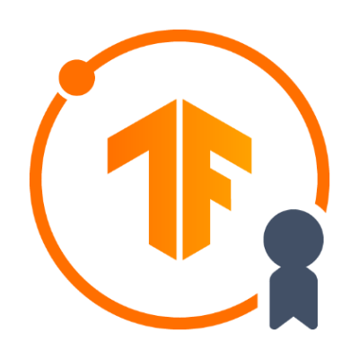

# TensorFlow Developer Certificate Achievement

## Achievement

I am thrilled to announce that I have successfully achieved the **TensorFlow Developer Certificate** by TensorFlow.

## Certificate

## About the Certification

The TensorFlow Developer Certificate demonstrates proficiency in the foundational concepts of building TensorFlow models using deep learning principles. This certification validates my skills in:

- TensorFlow fundamentals
- Neural network models
- Convolutional Neural Networks (CNNs)
- Natural Language Processing (NLP)
- Computer Vision
- Sequences, Time Series, and Prediction

This certification not only signifies my expertise in using TensorFlow to develop and train machine learning models but also highlights my commitment to staying updated with the latest advancements in the field.

## Validation

This certification can be validated on the [TensorFlow Certificate Network](https://developers.google.com/certification/directory/tensorflow).

## Date of Achievement

The certification was earned on November 02, 2023.

---